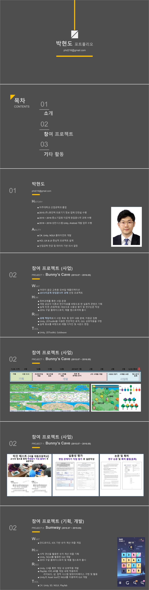
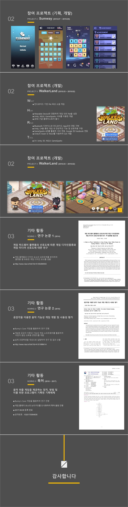

개발자 박현도의 포트폴리오 입니다

  <a href="{{ baseurl }}/assets/documents/myPortf.pdf" class="btn btn--primary">PDF 파일 다운로드 (1.20mb)</a>
<!-- [PDF 파일로 보기 ( 1.20mb )](../assets/documents/myPortf.pdf){:.btn .btn--info .center} -->

 

